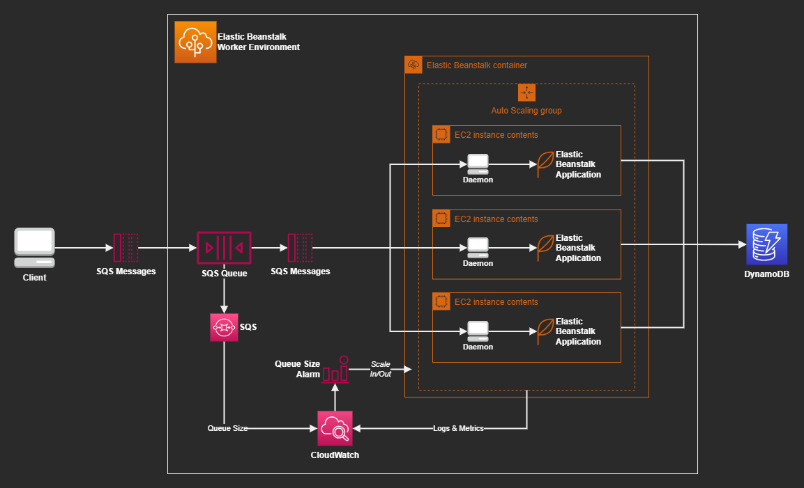

# AWS Elastic Beanstalk Worker Environment

Hands-on architecture for worker-type applications with long-running tasks using Beanstalk. This configuration scales based on queue size and is highly-available across multiple availability zones.



Get to know Beanstalk Worker by reading the [documentation](https://docs.aws.amazon.com/elasticbeanstalk/latest/dg/using-features-managing-env-tiers.html).

## Cloud Deployment

Use these instructions to create the infrastructure and deploy directly to the cloud.

First create the TF config file:

```sh
touch infra/.auto.tfvars
```

Set the environment according to your preferences:

```hcl
region = "us-east-2"

availability_zone_a = "us-east-2a"
availability_zone_b = "us-east-2b"
availability_zone_c = "us-east-2c"

autoscaling_cooldown = 500
autoscaling_min_size = 1
autoscaling_max_size = 2

ec2_instance_types = "t2.micro"

sqs_daemon_max_concurrent_connections = 1
sqs_daemon_inactivity_timeout         = 499
sqs_daemon_visibility_timeout         = 500
sqs_daemon_max_retries                = 3
```

Create the infrastructure:

```sh
terraform -chdir="infra" init
terraform -chdir="infra" apply -auto-approve
```

Get the queue URL and set it as a variable:

```sh
export queue="https://sqs.<region>.amazonaws.com/<account>/<name>"
```

Enter the application directory:

```sh
cd worker
```

Init the application with the EB CLI:

```sh
eb init
```

Deploy the application:

```sh
bash deploy.sh
```

> ⚠️ Had to make the `bash scripts/deploy.sh` script for now. For some reason `node_modules` is not being ignored by the `.ebignore` and is being sent corrupted, and when `node_modules` is present it doesn't trigger the automatic npm install managed by Beanstalk.

Test it by sending messages to the queue:

```sh
# This will send 3 batches of 10 messages each = 30 messages in total
bash scripts/send-sqs-batch.sh 3
```

If everything worked accordingly the worker nodes should start processing the messages.

> 💡 CloudWatch alarms will trigger auto-scaling _in_ or _out_ when queue size meets the threshold

You may want to recreate the DynamoDB table between tests:

```sh
# Deletion process is asynchronous
bash scripts/delete-dynamodb-table

# Once deleted, create it again
bash scripts/create-dynamodb-table
```

## Application Development

While in the application directory `worker`, create the `.env`:

```sh
touch .env
```

Add values according to your preferences:

```sh
LONG_RUNNING_TASK_DURATION=0
PORT=8080
DYNAMODB_REGION="us-east-2"
DYNAMODB_TABLE_NAME="BeanstalkTasks"
```

Install dependencies and start the application:

```sh
npm i
npm run dev
```

Send POST requests to localhost:8080

---

### Clean-up

When done, delete the resources:

```sh
terraform destroy
```

## References

[Blog: AWS Elastic Beanstalk Worker Auto Scaling By Queue Size](https://jun711.github.io/aws/aws-elastic-beanstalk-worker-auto-scaling-by-queue-size/)

[AWS: General options for all Beanstalk environments](https://docs.aws.amazon.com/elasticbeanstalk/latest/dg/command-options-general.html)

[AWS: Deploying an Express application to Elastic Beanstalk](https://docs.amazonaws.cn/en_us/elasticbeanstalk/latest/dg/create_deploy_nodejs_express.html)

[AWS: Using the Elastic Beanstalk Node.js platform](https://docs.aws.amazon.com/elasticbeanstalk/latest/dg/create_deploy_nodejs.container.html)

[AWS: Configuring the application process with a Procfile](https://docs.aws.amazon.com/elasticbeanstalk/latest/dg/nodejs-configuration-procfile.html)

[AWS: Extending Elastic Beanstalk Linux platforms](https://docs.aws.amazon.com/elasticbeanstalk/latest/dg/platforms-linux-extend.html)

[SO: nginx timeout](https://stackoverflow.com/a/49759065/3231778)